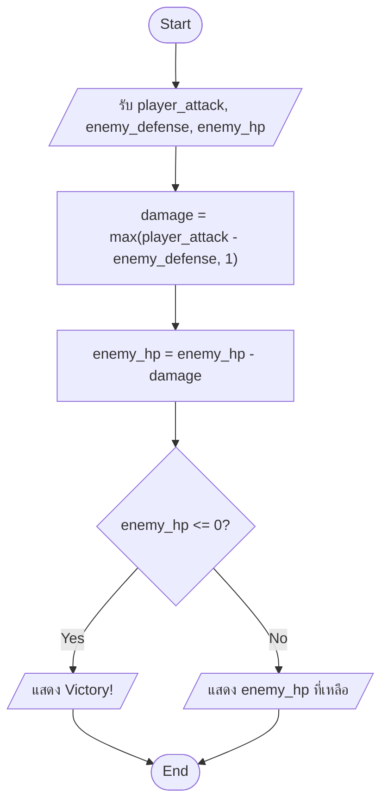
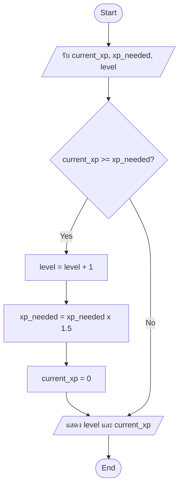

```mermaid
flowchart TD
Start([Start]) --> Input[/รับ player_attack, enemy_defense, enemy_hp/]
Input --> Calc["damage = max(player_attack - enemy_defense, 1)"]
Calc --> Reduce["enemy_hp = enemy_hp - damage"]
Reduce --> D1{enemy_hp <= 0?}
D1 -->|Yes| Win[/แสดง Victory!/]
D1 -->|No| Show[/แสดง enemy_hp ที่เหลือ/]
Win & Show --> End([End])
```

---

```mermaid
flowchart TD
Start([Start]) --> Input[/รับ current_xp, xp_needed, level/]
Input --> D1{current_xp >= xp_needed?}
D1 -->|Yes| s1[level = level + 1]
s1 --> s2[xp_needed = xp_needed x 1.5]
s2 --> s3[current_xp = 0]
s3 --> total
D1 -->|No| total[/แสดง level และ current_xp/]
total --> End([End])
```
